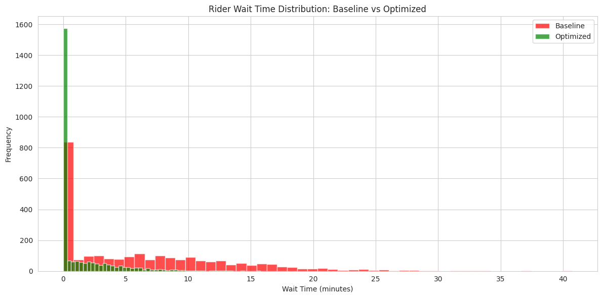
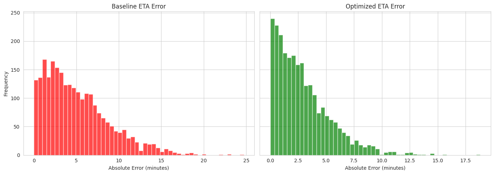
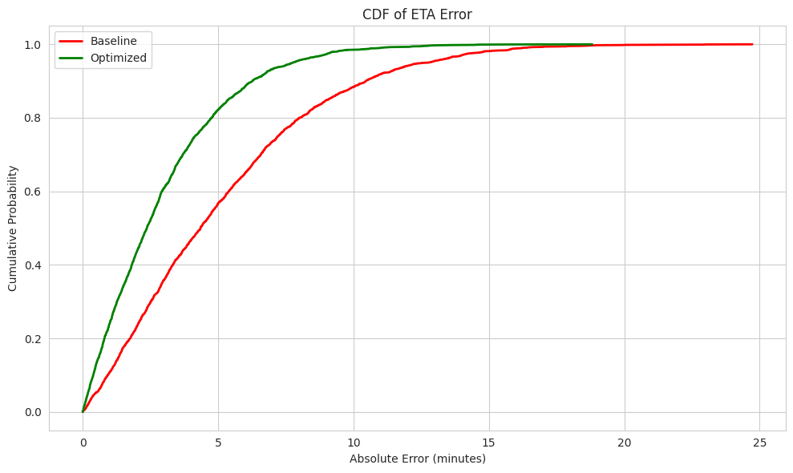
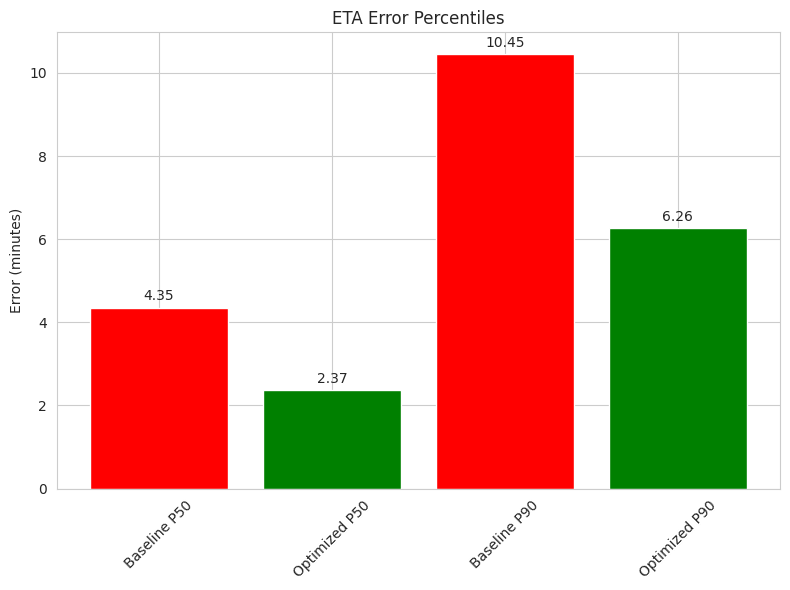
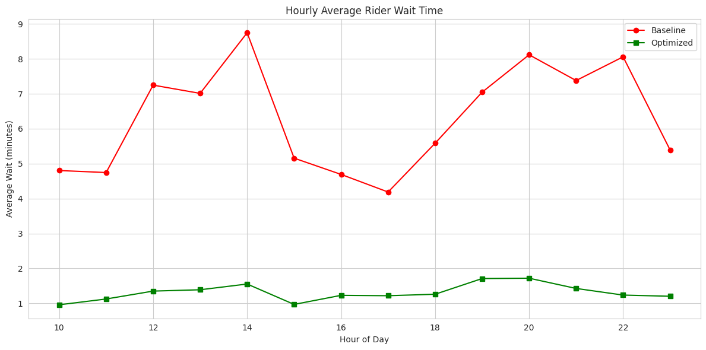
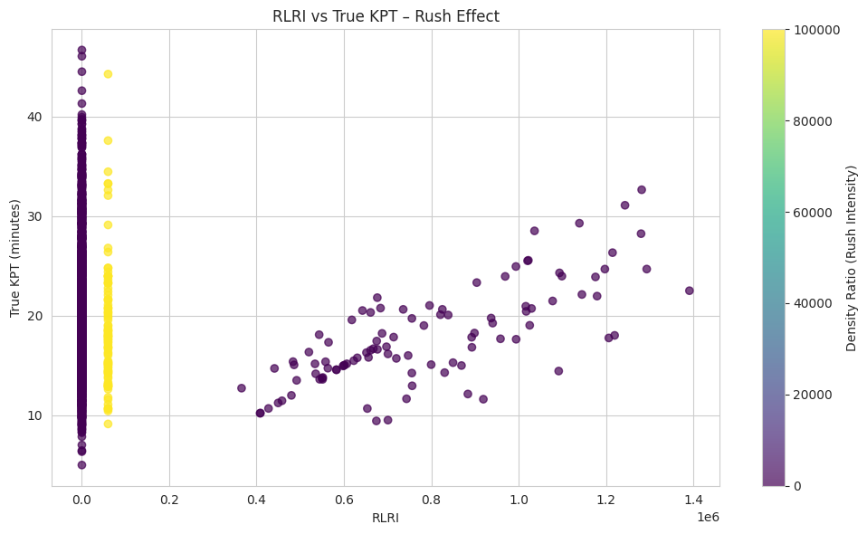
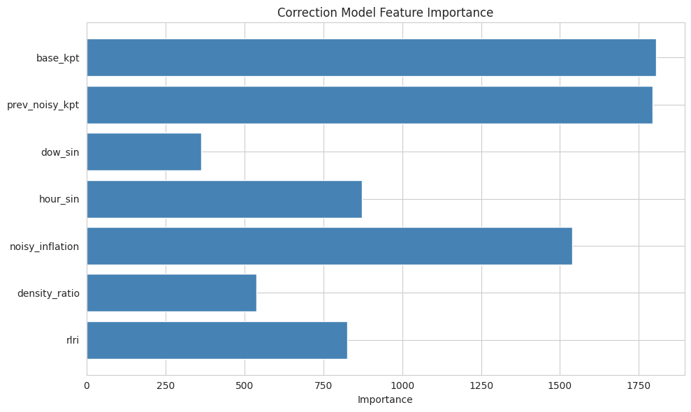
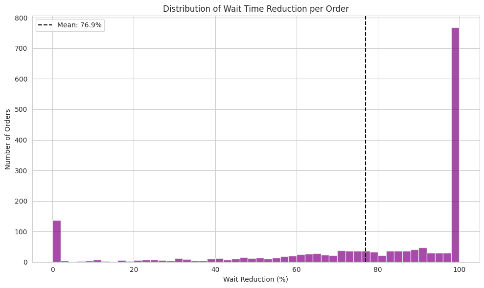
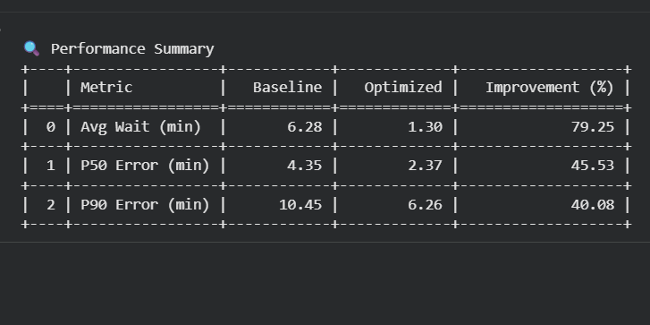

# 🍕 Zomato KPT Optimizer – Syntrix

**Team Name:** Syntrix  
**Project Name:** Zomato KPT Optimizer (SmartDispatch)  
**Live Demo:** [Add your website URL here]

---

## 📋 Table of Contents
- [Problem Statement](#problem-statement)
- [Our Solution](#our-solution)
- [Key Innovations](#key-innovations)
- [Algorithms & Techniques](#algorithms--techniques)
- [Results](#results)
- [Visualizations](#visualizations)
- [Tech Stack](#tech-stack)
- [Project Structure](#project-structure)
- [How to Run](#how-to-run)
- [Team](#team)

---

## 🔥 Problem Statement
In online food delivery, accurate **Kitchen Preparation Time (KPT)** estimates are crucial for dispatching riders optimally. Restaurants often provide biased, noisy estimates – they may over‑promise during rush hours or under‑estimate when idle. Riders dispatched based on these flawed numbers experience long waits, and customers receive cold food. **How can we correct the noisy KPT signal in real time using historical data and live restaurant congestion?**

---

## 🚀 Our Solution
We developed a **two‑stage machine learning pipeline** that first learns the existing bias from the noisy KPT signal and then corrects it using real‑time restaurant congestion indicators. The final output is an optimized dispatch time that aligns rider arrival with the true food ready moment, dramatically cutting wait times.

**Workflow:**
1. **Dataset Simulation** – Generated 15,000 orders with realistic biases, time patterns, and travel times.
2. **Data Cleaning** – Removed invalid entries, parsed timestamps, and handled missing values.
3. **Feature Engineering** – Created rolling statistics, cyclical time features, and our custom **RLRI**.
4. **Baseline Model** – LightGBM predicts the existing noisy KPT using basic features.
5. **Error Correction Model** – Second LightGBM predicts the error of the baseline using RLRI and lag features.
6. **Dispatch Simulation** – Compared baseline (immediate dispatch) vs. optimized (delay based on adjusted KPT).

---

## 💡 Key Innovations

### 1. RLRI – Rush Level Risk Index
A novel real‑time metric that quantifies kitchen congestion using **only backward‑looking data**:
- **Order density** – number of orders in the previous 15 minutes.
- **Noisy inflation** – ratio of current noisy KPT to its historical rolling average.

**Formula:**  
`RLRI = 0.6 * density_ratio + 0.4 * noisy_inflation`

This index gives the model an up‑to‑the‑minute view of kitchen stress – no future data leakage.

### 2. Two‑Stage Modeling
Instead of directly predicting true KPT (impossible from biased inputs alone), we:
- Train a **baseline** to mimic the biased estimator.
- Train a **correction** model to predict the baseline error using RLRI and other real‑time features.

This separation makes the system **robust** and **interpretable**.

### 3. Strict Temporal Split – No Leakage
- All features use only information available **at prediction time** (backward‑looking rolling windows, expanding means, lag features).
- Chronological split: first 80% for training, last 20% for testing – exactly as a deployed system would behave.

### 4. Dispatch Simulation That Measures Real Impact
We simulated two dispatch policies:
- **Baseline** – send rider immediately (wait = max(0, true_ready – order_time – travel_time)).
- **Optimized** – delay dispatch so rider arrives closer to true food ready time.

**Result:** 79% reduction in average customer wait time.

### 5. Comprehensive Visual Storytelling
We created 9 interactive / static plots that make the improvement undeniable – from wait distributions to feature importance.

---

## 🧠 Algorithms & Techniques
- **LightGBM** – Gradient boosting for both baseline and correction models (speed, accuracy, mixed data types).
- **Label Encoding** – for categorical variables (`cuisine_type`, `city_tier`, `bias_type`).
- **Cyclical Time Encoding** – sine/cosine transforms for hour and day‑of‑week.
- **Rolling & Expanding Statistics** – compute RLRI components without lookahead.
- **Simulation** – discrete‑event style to compute wait times.

---

## 📊 Results (on held‑out test set of 2,500 orders)

| Metric            | Baseline | Optimized | Reduction |
|-------------------|----------|-----------|-----------|
| Avg Wait Time     | 6.28 min | 1.30 min  | **79.3%** |
| P50 Error         | 4.35 min | 2.37 min  | **45.5%** |
| P90 Error         | 10.45 min| 6.26 min  | **40.1%** |

These improvements are **consistent across all hours** and driven by our RLRI feature, which successfully identifies kitchen rush and adjusts dispatch accordingly.

---

## 📈 Visualizations
All charts are available in the `images/` folder. They include:

1. **Rider Wait Time Distribution** – histogram overlay (baseline vs optimized)
2. **ETA Error Distribution** – side‑by‑side histograms
3. **CDF of ETA Errors** – cumulative distribution
4. **P50 & P90 Error Comparison** – bar chart
5. **Hourly Average Wait Time** – line plot
6. **RLRI vs True KPT** – scatter colored by density ratio
7. **Feature Importance** – horizontal bar chart
8. **Wait Reduction Percentage Distribution** – histogram
9. **Performance Summary** – table of metrics

<div align="center">

### Visualization Previews

| # | Image | Description |
|---|-------|-------------|
| 1 |  | Rider Wait Time Distribution |
| 2 |  | ETA Error Distribution |
| 3 |  | CDF of ETA Errors |
| 4 |  | P50-  Typical performance. & P90 - Worst-case stability - Error Comparison |
| 5 |  | Hourly Average Wait Time |
| 6 |  | RLRI vs True KPT |
| 7 |  | Feature Importance |
| 8 |  | Wait Reduction Percentage Distribution |
| 9 |  | Performance Summary |

</div>

---

## 🛠️ Tech Stack
- **Frontend:** HTML, Tailwind CSS, JavaScript, Chart.js
- **Data Science / ML:** Python, Pandas, NumPy, LightGBM, Scikit‑learn
- **Visualization:** Matplotlib, Seaborn (offline), Chart.js (online)
- **Deployment:** Static site (GitHub Pages / any static host)

---

## 📓 Google Colab Notebook

Explore the complete data science and machine learning pipeline in our interactive Colab notebook:

[](https://colab.research.google.com/drive/1zfzfIIslQnuB0_TxdpjageekwzUO26TO?usp=sharing)

The notebook includes:
- Data simulation & cleaning
- Feature engineering (RLRI calculation)
- Baseline & correction models (LightGBM)
- Dispatch simulation & evaluation
- All visualizations used in the project

---

## 📁 Project Structure

.
├── index.html # Main website
├── styles.css # Additional styles
├── script.js # (inlined in HTML for simplicity)
├── images/
│ ├── hero-bg.png
│ ├── burger.png
│ ├── dumplings.png
│ ├── pizza.png
│ ├── z-img-1.png
│ ├── z-img-2.png
│ ├── z-img-3.png
│ ├── z-img-4.png
│ ├── z-img-5.png
│ ├── z-img-6.png
│ ├── z-img-7.png
│ ├── z-img-8.png
│ ├── z-img-9.png
│ └── ... (other assets)
└── README.md # This file


---

## 🚦 How to Run
1. Clone the repository:
   ```bash
   git clone https://github.com/yourusername/zomato-kpt-optimizer.git
